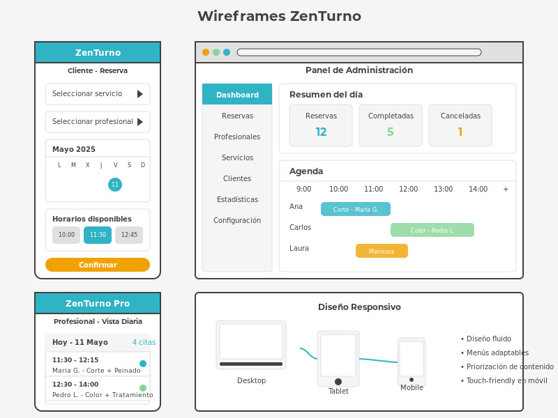
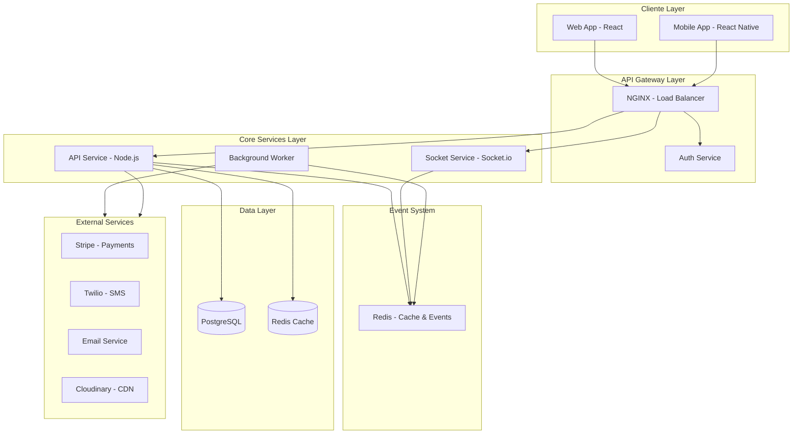
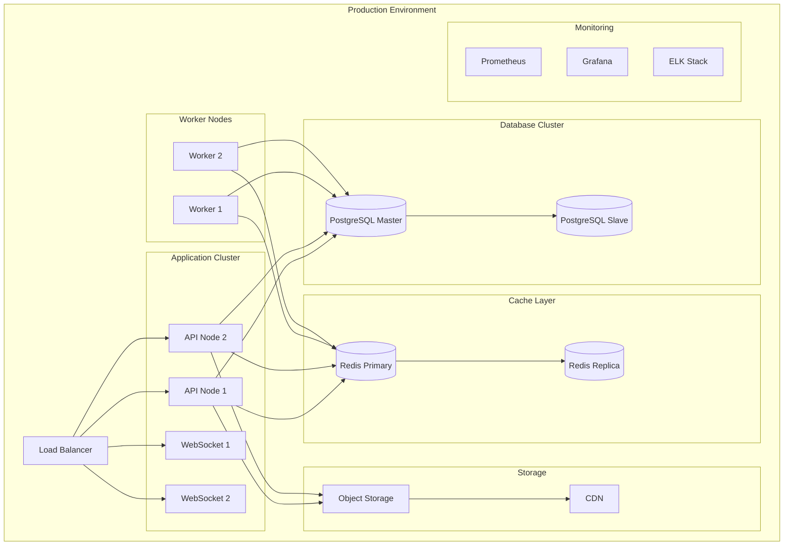
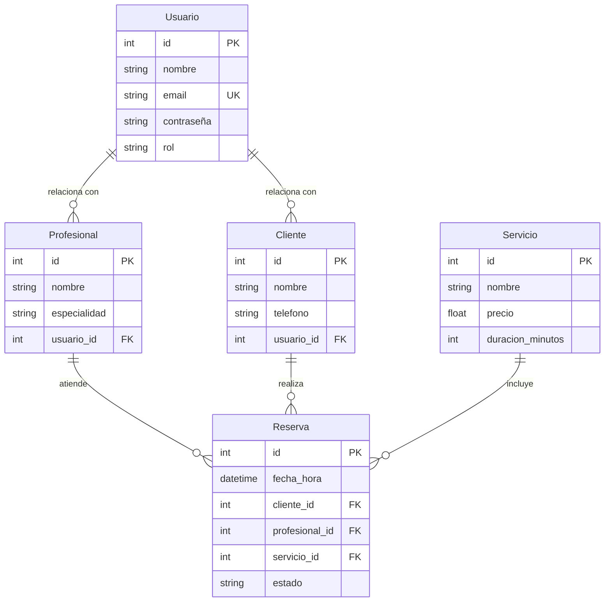

## Índice

0. [Ficha del proyecto](#0-ficha-del-proyecto)
1. [Descripción general del producto](#1-descripción-general-del-producto)
2. [Arquitectura del sistema](#2-arquitectura-del-sistema)
3. [Modelo de datos](#3-modelo-de-datos)
4. [Especificación de la API](#4-especificación-de-la-api)
5. [Historias de usuario](#5-historias-de-usuario)
6. [Tickets de trabajo](#6-tickets-de-trabajo)
7. [Pull requests](#7-pull-requests)

---

## 0. Ficha del proyecto

### **0.1. Tu nombre completo:**
Jorge Ronceros Caceres /
Omari Sopromadze Zirakadze

### **0.2. Nombre del proyecto:**
ZenTurno

### **0.3. Descripción breve del proyecto:**
ZenTurno es una plataforma integral de gestión de citas que simplifica la reserva de turnos en peluquerías y consultorios. Permite a los clientes programar, modificar y cancelar citas online las 24 horas, mientras ofrece a los negocios un sistema completo para administrar profesionales, servicios y agenda. Con notificaciones automáticas, estadísticas de rendimiento e historial de clientes, ZenTurno optimiza la organización del tiempo, reduce cancelaciones y mejora la experiencia tanto para usuarios como para establecimientos.


### **0.4. URL del proyecto:**

> Puede ser pública o privada, en cuyo caso deberás compartir los accesos de manera segura. Puedes enviarlos a [alvaro@lidr.co](mailto:alvaro@lidr.co) usando algún servicio como [onetimesecret](https://onetimesecret.com/).

### 0.5. URL o archivo comprimido del repositorio

> Puedes tenerlo alojado en público o en privado, en cuyo caso deberás compartir los accesos de manera segura. Puedes enviarlos a [alvaro@lidr.co](mailto:alvaro@lidr.co) usando algún servicio como [onetimesecret](https://onetimesecret.com/). También puedes compartir por correo un archivo zip con el contenido


---

## 1. Descripción general del producto
ZenTurno es un sistema donde los usuarios reservan turnos según disponibilidad, y el administrador gestiona el calendario.

### **1.1. Objetivo:**

ZenTurno es una plataforma integral de gestión de reservas diseñada específicamente para negocios de servicios personales como peluquerías, barberías y estéticos. Su propósito principal es optimizar y automatizar el proceso de reserva de citas, eliminando las ineficiencias de los sistemas manuales tradicionales. ZenTurno aporta valor tanto a los propietarios de negocios como a sus clientes, reduciendo el tiempo dedicado a la gestión de agenda, minimizando los turnos perdidos, y ofreciendo una experiencia de reserva fluida y accesible las 24 horas.

### **1.2. Características y funcionalidades principales:**
   - Reservas online: Sistema intuitivo que permite a los clientes reservar, modificar o cancelar citas desde cualquier dispositivo sin necesidad de llamadas telefónicas.
   - Gestión de agenda avanzada: Calendario dinámico que sincroniza automáticamente las reservas de múltiples profesionales, evitando solapamientos y optimizando los tiempos entre servicios.
   - Perfiles personalizados: Cada profesional cuenta con su perfil donde se muestran sus especialidades, horarios y valoraciones de clientes.
   - Recordatorios automáticos: Notificaciones por email y SMS a clientes y profesionales para reducir la tasa de ausencias.
   - Panel de administración: Control total del negocio con estadísticas de ocupación, servicios más solicitados y rendimiento por profesional.
   - Sistema de fidelización: Programa de puntos, descuentos por frecuencia y promociones personalizadas para clientes recurrentes.
   - Integración de pagos: Reserva con señas o pago completo anticipado mediante diversos métodos (tarjeta, transferencia, billeteras digitales).
   - Historial de clientes: Registro detallado de visitas, servicios realizados, preferencias y observaciones para personalizar la atención.
   - Recursos y stock: Control de inventario de productos utilizados y disponibilidad de espacios físicos.
   - Interfaz responsive: Diseño adaptable a cualquier dispositivo (móvil, tablet, ordenador) para facilitar su uso tanto a clientes como empleados.
   - Modo offline: Funcionalidad básica disponible aun sin conexión a internet para registrar citas en el local.
   - Multiidioma: Disponible en español, inglés y otros idiomas según la región de implementación.

ZenTurno transforma la experiencia de reserva de turnos, ofreciendo una solución completa que reduce la carga administrativa, mejora la satisfacción del cliente y permite a los negocios enfocarse en lo que mejor saben hacer: proporcionar servicios de calidad.   

### **1.3. Diseño y experiencia de usuario:**

#### Principios de Diseño

##### 1. Simplicidad y Claridad
- Interfaz minimalista con navegación intuitiva
- Flujo de reserva simplificado en pocos pasos
- Jerarquía visual clara que prioriza las acciones principales

##### 2. Consistencia
- Lenguaje visual uniforme en todas las plataformas
- Patrones de interacción reconocibles
- Terminología coherente en toda la aplicación

##### 3. Accesibilidad
- Diseño inclusivo siguiendo estándares WCAG 2.1 AA
- Contraste adecuado para usuarios con discapacidad visual
- Compatibilidad con lectores de pantalla

##### 4. Flexibilidad
- Experiencia adaptada para distintos tipos de negocios
- Personalización por establecimiento (colores, logos)
- Opciones de configuración según necesidades específicas

#### Experiencia de Usuario

##### 1. Cliente Final
###### Flujo de Reserva:
1. Registro/Inicio de sesión (opcional para primera reserva)
2. Selección del establecimiento (si hay múltiples locales)
3. Elección del servicio deseado
4. Selección del profesional preferido o disponible
5. Visualización del calendario con disponibilidad en tiempo real
6. Selección de fecha y hora
7. Confirmación y opción de pago anticipado
8. Recepción de confirmación y recordatorios

###### Funcionalidades clave:
- Historial de citas previas
- Sistema de favoritos (profesionales y servicios)
- Valoraciones post-servicio
- Notificaciones personalizables
- Reprogramación o cancelación con políticas claras

##### 2. Administrador/Propietario
###### Panel de control principal:
- Vista consolidada de métricas clave y agenda diaria
- Alertas sobre situaciones que requieren atención
- Acceso rápido a funciones frecuentes

###### Áreas principales:
- Gestión de agenda y reservas
- Administración de profesionales y horarios
- Configuración de servicios y precios
- Estadísticas e informes de rendimiento
- Gestión de clientes y comunicaciones
- Configuración del establecimiento

##### 3. Profesional/Empleado
###### Interfaz simplificada:
- Vista de agenda diaria/semanal personal
- Detalles de próximos clientes
- Historial de servicios realizados
- Gestión limitada de disponibilidad personal

#### Elementos de Diseño Visual

##### 1. Paleta de Colores
- **Primario**: Azul turquesa (`#30B4C5`) - Transmite calma, confianza y profesionalismo
- **Secundario**: Verde menta (`#88D498`) - Representa frescura y bienestar
- **Acento**: Amarillo ámbar (`#F0A202`) - Destaca acciones importantes
- **Neutros**: 
  - Gris claro (`#F5F5F5`)
  - Gris medio (`#E0E0E0`)
  - Gris oscuro (`#424242`)

##### 2. Tipografía
- **Títulos**: Montserrat (Sans-serif) - Moderna y de alta legibilidad
- **Cuerpo**: Open Sans - Excelente legibilidad en todos los tamaños
- **Escalas**:
  - H1: 24px/30px
  - H2: 20px/26px
  - Cuerpo: 16px/24px
  - Pequeño: 14px/20px

##### 3. Componentes UI
- **Botones**: Esquinas redondeadas con estados claros (hover, active, disabled)
- **Tarjetas**: Sombras suaves para elevación y jerarquía
- **Iconografía**: Sistema de iconos coherente y minimalista
- **Espaciado**: Sistema de grid de 8px para consistencia

#### Prototipos y Wireframes



Los wireframes muestran las interfaces clave de ZenTurno: la vista móvil para clientes, el panel de administración para propietarios del negocio, y la vista simplificada para profesionales. El diseño responsivo garantiza una experiencia coherente en todos los dispositivos mientras mantiene la simplicidad y efectividad de cada interfaz según su contexto de uso.

#### Navegación y Flujos de Usuario

##### 1. Cliente Final
###### Flujo principal de navegación:
```
Inicio → Registro/Login → Explorar Servicios → Seleccionar Servicio → 
Elegir Profesional → Seleccionar Fecha/Hora → Confirmar Reserva → Recibir Confirmación
```

###### Flujos secundarios:
- **Gestión de perfil**: Mi Cuenta → Información Personal / Preferencias / Historial
- **Reprogramación**: Mis Reservas → Seleccionar Reserva → Reprogramar → Elegir Nueva Fecha/Hora
- **Cancelación**: Mis Reservas → Seleccionar Reserva → Cancelar → Confirmar Cancelación

##### 2. Administrador
###### Navegación principal:
Dashboard → Reservas / Profesionales / Servicios / Clientes / Estadísticas / Configuración

###### Gestión de reservas:
Reservas → Vista Calendario / Lista de Reservas → Detalles de Reserva → Confirmar / Reprogramar / Cancelar / Completar

###### Gestión de recursos:
Profesionales → Listado → Ver/Editar Profesional → Horarios / Servicios / Estadísticas

#### Estrategia de Interacción

##### 1. Feedback Visual
- Confirmaciones visuales inmediatas tras acciones importantes
- Indicadores de progreso durante procesos multi-paso
- Estados visibles para elementos interactivos (hover, active, visited)

##### 2. Notificaciones
- Sistema de notificaciones en-app con categorías (urgente, informativo)
- Notificaciones por correo electrónico y SMS personalizables
- Recordatorios graduales (24h, 2h antes de cita)

##### 3. Prevención de Errores
- Validación en tiempo real de formularios
- Mensajes claros de error con sugerencias de corrección
- Confirmación para acciones destructivas o de alto impacto

##### 4. Personalización
- Adaptación de contenido según historial del usuario
- Sugerencias basadas en preferencias previas
- Configuración de vista (modo claro/oscuro, densidad de información)

#### Pruebas de Usabilidad

##### 1. Métodos de Evaluación
- Test A/B de flujos críticos
- Entrevistas con usuarios reales de diferentes perfiles
- Pruebas de tiempo para tareas comunes
- Mapas de calor para identificar puntos de fricción

##### 2. Métricas de Seguimiento
- Tasa de abandono en flujo de reserva
- Tiempo de completado para tareas frecuentes
- Satisfacción del usuario (NPS, CSAT)
- Frecuencia de uso de funciones clave

#### Consideraciones Adicionales

##### 1. Modo Offline
- Sincronización automática al recuperar conexión
- Caché inteligente de datos frecuentes
- Indicadores de estado de conexión

##### 2. Rendimiento
- Tiempo de carga inicial optimizado (<3 segundos)
- Carga progresiva de contenido
- Optimización para conexiones lentas

##### 3. Micro-interacciones
- Animaciones sutiles para transiciones
- Feedback táctil en dispositivos móviles
- Sonidos discretos opcionales para confirmaciones

##### 4. Internacionalización
- Diseño adaptable a diferentes longitudes de texto
- Soporte para RTL (árabe, hebreo)
- Adaptación cultural de iconografía y colores

### **1.4. Instrucciones de instalación:**
Esta guía proporciona instrucciones detalladas para instalar y configurar el sistema de gestión de citas ZenTurno en un entorno local de desarrollo.
Requisitos Previos
Asegúrate de tener instalado en tu sistema:

  - Node.js (v16.x o superior)
  - npm (v8.x o superior) o yarn (v1.22.x o superior)
  - PostgreSQL (v14.x o superior)
  - Git (v2.x o superior)
  - Redis (v6.x o superior) - para sistema de colas y caché

Herramientas recomendadas:

  - Visual Studio Code o cualquier IDE de preferencia
  - Postman o Insomnia para pruebas de API
  - pgAdmin o DBeaver para gestión de base de datos

Estructura del Proyecto
ZenTurno está organizado como un monorepo con la siguiente estructura:

zenturno/
├── backend/           # API REST en Node.js/Express
├── frontend/          # Aplicación React para clientes y administración
├── mobile/            # Aplicación React Native para profesionales
├── common/            # Código compartido entre proyectos
└── docs/              # Documentación

### Configuración de la Base de Datos

#### 1. Crear base de datos en PostgreSQL
Puedes usar el cliente pgAdmin o ejecutar en terminal:
```sql
psql -U postgres
CREATE DATABASE zenturno_dev;
CREATE USER zenturno_user WITH ENCRYPTED PASSWORD 'zenturno_password';
GRANT ALL PRIVILEGES ON DATABASE zenturno_dev TO zenturno_user;
\q
```

#### 2. Configurar conexión a la base de datos
Copia el archivo de ejemplo de variables de entorno:
```bash
cd backend
cp .env.example .env
```

Edita el archivo `.env` con los datos de conexión a tu base de datos local:
```env
DB_HOST=localhost
DB_PORT=5432
DB_NAME=zenturno_dev
DB_USER=zenturno_user
DB_PASSWORD=zenturno_password
```

#### 3. Ejecutar migraciones
```bash
cd backend
npx sequelize-cli db:migrate
```

#### 4. Cargar datos iniciales (seeds)
```bash
npx sequelize-cli db:seed:all
```

### Instalación del Frontend

#### 1. Instalar dependencias del frontend
```bash
cd ../frontend
npm install
```

#### 2. Configurar variables de entorno del frontend
```bash
cp .env.example .env.local
```

Edita el archivo `.env.local` con la URL del backend:
```env
REACT_APP_API_URL=http://localhost:3001/api
REACT_APP_SOCKET_URL=http://localhost:3001
```

### Variables de Entorno

#### Backend (.env)
```env
# Servidor
PORT=3001
NODE_ENV=development

# JWT Auth
JWT_SECRET=your_very_secure_jwt_secret_key
JWT_EXPIRATION=24h

# Email (para notificaciones)
SMTP_HOST=smtp.example.com
SMTP_PORT=587
SMTP_USER=your_email@example.com
SMTP_PASS=your_email_password
EMAIL_FROM=noreply@zenturno.com

# SMS (opcional)
TWILIO_ACCOUNT_SID=your_twilio_account_sid
TWILIO_AUTH_TOKEN=your_twilio_auth_token
TWILIO_PHONE_NUMBER=+12345678901

# Redis
REDIS_HOST=localhost
REDIS_PORT=6379
REDIS_PASSWORD=

# Cloudinary (almacenamiento de imágenes)
CLOUDINARY_CLOUD_NAME=your_cloud_name
CLOUDINARY_API_KEY=your_api_key
CLOUDINARY_API_SECRET=your_api_secret
```

#### Frontend (.env.local)
```env
# API
REACT_APP_API_URL=http://localhost:3001/api
REACT_APP_SOCKET_URL=http://localhost:3001

# Analíticas (opcional)
REACT_APP_GA_TRACKING_ID=UA-XXXXXXXXX-X

# Mapas (opcional)
REACT_APP_GOOGLE_MAPS_API_KEY=your_google_maps_api_key

# Pagos (opcional)
REACT_APP_STRIPE_PUBLIC_KEY=your_stripe_public_key
```

### Ejecución del Proyecto

#### 1. Iniciar el servidor backend
```bash
cd backend
npm run dev
```
El servidor estará disponible en `http://localhost:3001`

#### 2. Iniciar el cliente frontend
En una nueva terminal:
```bash
cd frontend
npm start
```
La aplicación web estará disponible en `http://localhost:3000`

#### 3. Iniciar Redis
En una nueva terminal (si no está ejecutándose como servicio):
```bash
redis-server
```

### Datos de Prueba
Después de cargar los seeds, podrás acceder con los siguientes usuarios de prueba:

#### Administrador
- **Email**: `admin@zenturno.com`
- **Contraseña**: `Admin123!`

#### Profesional
- **Email**: `profesional@zenturno.com`
- **Contraseña**: `Prof123!`

#### Cliente
- **Email**: `cliente@zenturno.com`
- **Contraseña**: `Cliente123!`

### Solución de Problemas Comunes

#### Error de conexión a la base de datos
- Verifica que PostgreSQL esté en ejecución
- Comprueba las credenciales en tu archivo `.env`
- Asegúrate de haber creado la base de datos

```bash
# Verificar estado de PostgreSQL en Linux/Mac
sudo service postgresql status

# Verificar estado de PostgreSQL en Windows
net start | findstr /i "postgresql"
```

#### Error de CORS en el frontend
Si encuentras errores de CORS al conectar el frontend con el backend:
1. Verifica que las URL configuradas sean correctas
2. Comprueba que el middleware CORS esté correctamente configurado en el backend

#### Error en migraciones
Si hay problemas con las migraciones:
```bash
# Deshacer todas las migraciones
npx sequelize-cli db:migrate:undo:all

# Volver a ejecutar migraciones
npx sequelize-cli db:migrate

# Regenerar datos
npx sequelize-cli db:seed:all
```

### Configuraciones Adicionales

#### Configuración de Email Transaccional
Para configurar el envío de emails, debes agregar las credenciales SMTP en las variables de entorno del backend.
Para desarrollo, puedes usar servicios como Mailtrap que proporcionan un entorno de prueba para emails.

#### Configuración de Pagos (Stripe)
1. Crea una cuenta en Stripe
2. Obtén tus claves API de prueba
3. Configura las variables de entorno correspondientes

#### Configuración de SMS (Twilio)
1. Crea una cuenta en Twilio
2. Obtén tus credenciales
3. Configura las variables de entorno correspondientes

#### Almacenamiento de Imágenes (Cloudinary)
1. Crea una cuenta en Cloudinary
2. Obtén tus credenciales
3. Configura las variables de entorno correspondientes

#### Configuración de WebSockets
El sistema utiliza Socket.io para notificaciones en tiempo real. Asegúrate de que los puertos necesarios estén abiertos y que la URL del socket esté correctamente configurada en el frontend.

### Modo de Desarrollo vs Producción
Ten en cuenta que esta guía está orientada al entorno de desarrollo. Para despliegue en producción se requieren configuraciones adicionales de seguridad, optimización y escalabilidad.

Para dudas o problemas durante la instalación, consulta la documentación detallada en la carpeta `docs/` o contacta al equipo de desarrollo en `soporte@zenturno.com`.

## 2. Arquitectura del Sistema

### **2.1. Diagrama de arquitectura:**



La arquitectura de ZenTurno sigue un patrón de Monolito Modular con componentes event-driven, diseñado para optimizar la escalabilidad y mantenibilidad. 

#### Patrones Arquitectónicos Implementados:

1. **Monolito Modular**
   - Facilita el desarrollo y despliegue inicial
   - Permite futura migración a microservicios si es necesario
   - Mantiene la base de código manejable y cohesiva

2. **Event-Driven Architecture**
   - Gestión de eventos en tiempo real mediante Redis
   - Desacoplamiento de servicios críticos
   - Mejor manejo de picos de carga

3. **Circuit Breaker Pattern**
   - Implementado para servicios externos (Stripe, Twilio, etc.)
   - Previene fallos en cascada
   - Mejora la resiliencia del sistema

#### Beneficios Principales:

1. **Escalabilidad**
   - Componentes independientemente escalables
   - Cache distribuida con Redis
   - Load balancing con NGINX

2. **Mantenibilidad**
   - Separación clara de responsabilidades
   - Modularización por dominio de negocio
   - Fácil integración de nuevos servicios

3. **Rendimiento**
   - Caché en múltiples niveles
   - Procesamiento asíncrono de tareas pesadas
   - Optimización de queries con Redis

4. **Disponibilidad**
   - Soporte offline
   - Redundancia en servicios críticos
   - Manejo graceful de fallos

#### Sacrificios y Consideraciones:

1. **Complejidad**
   - Mayor complejidad inicial en configuración
   - Necesidad de gestionar estado distribuido
   - Curva de aprendizaje para nuevos desarrolladores

2. **Costos**
   - Múltiples servicios externos
   - Necesidad de monitorización robusta
   - Recursos para caché y mensajería

3. **Latencia**
   - Overhead por comunicación entre servicios
   - Dependencia de servicios externos
   - Necesidad de optimizar network calls

### **2.2. Descripción de componentes principales:**

#### 1. Frontend Layer
- **Web Application (React)**
  - Framework: React 18 con TypeScript
  - State Management: Redux Toolkit + RTK Query
  - UI Framework: Material-UI v5
  - PWA con soporte offline
  - Client-side caching con React Query

- **Mobile Application (React Native)**
  - Framework: React Native con TypeScript
  - State Management: Redux Toolkit
  - UI: React Native Paper
  - Offline-first approach
  - Push notifications

#### 2. API Gateway Layer
- **NGINX**
  - Load balancing con algoritmo least_conn
  - SSL/TLS termination
  - Rate limiting y throttling
  - Compression y caching
  - Health checks

- **Auth Service**
  - JWT-based authentication
  - OAuth2 para social login
  - Role-based access control (RBAC)
  - Session management con Redis
  - Rate limiting por usuario

#### 3. Core Services Layer
- **API Service (Node.js)**
  - Framework: Express.js
  - TypeScript para type safety
  - Domain-Driven Design (DDD)
  - Repository pattern
  - Error handling centralizado
  - API versioning
  - Swagger/OpenAPI documentation

- **Socket Service**
  - Socket.io para WebSockets
  - Rooms para agrupación de conexiones
  - Heartbeat para conexiones activas
  - Reconexión automática
  - Eventos en tiempo real

- **Background Worker**
  - Bull para gestión de colas
  - Procesamiento asíncrono
  - Retry policies configurables
  - Dead letter queues
  - Monitorización de jobs

#### 4. Event System
- **Redis (Message Broker)**
  - Pub/Sub para eventos en tiempo real
  - Stream processing
  - Gestión de colas FIFO
  - Cache distribuida
  - Rate limiting distribuido

#### 5. Data Layer
- **PostgreSQL**
  - Schemas por dominio
  - Migrations con TypeORM
  - Índices optimizados
  - Particionamiento de tablas
  - Connection pooling
  - Query optimization

- **Redis Cache**
  - Cache de sesiones
  - Cache de queries frecuentes
  - Distributed locking
  - Rate limiting
  - Leaderboards y contadores

#### 6. External Services
- **Stripe (Payments)**
  - Procesamiento de pagos
  - Webhooks para eventos
  - Manejo de disputas
  - Reportes financieros

- **Twilio (SMS)**
  - Notificaciones SMS
  - Verificación 2FA
  - Templates personalizados

- **Email Service**
  - Templates HTML responsivos
  - Queue de envíos
  - Tracking de apertura/click
  - Bounces handling

- **Cloudinary (CDN)**
  - Almacenamiento de imágenes
  - Transformaciones on-the-fly
  - Optimización automática
  - Cache distribuido

### **2.3. Descripción de alto nivel del proyecto y estructura de ficheros**

El proyecto sigue una arquitectura modular basada en Clean Architecture y Domain-Driven Design, con la siguiente estructura de directorios:

```
zenturno/
├── frontend/                 # Aplicación web React
│   ├── src/
│   │   ├── assets/          # Recursos estáticos
│   │   ├── components/      # Componentes reutilizables
│   │   ├── features/        # Módulos funcionales
│   │   ├── hooks/           # Custom hooks
│   │   ├── layouts/         # Plantillas de página
│   │   ├── services/        # Servicios API
│   │   └── utils/           # Utilidades comunes
│   └── public/              # Archivos públicos
│
├── mobile/                  # Aplicación React Native
│   ├── src/
│   │   ├── components/      # Componentes nativos
│   │   ├── navigation/      # Configuración de rutas
│   │   ├── screens/         # Pantallas principales
│   │   └── services/        # Servicios móviles
│   └── assets/              # Recursos móviles
│
├── backend/                 # Servidor Node.js
│   ├── src/
│   │   ├── config/         # Configuraciones
│   │   ├── domain/         # Lógica de negocio
│   │   │   ├── entities/   # Entidades core
│   │   │   ├── usecases/   # Casos de uso
│   │   │   └── repos/      # Interfaces repositorio
│   │   ├── infra/         # Implementaciones
│   │   │   ├── db/        # Acceso a datos
│   │   │   ├── external/  # Servicios externos
│   │   │   └── http/      # Controladores HTTP
│   │   └── utils/         # Utilidades
│   └── tests/             # Tests unitarios/integración
│
├── workers/                # Trabajadores en segundo plano
│   ├── email-worker/      # Procesamiento de emails
│   ├── notification/      # Notificaciones push/SMS
│   └── payment-hooks/     # Webhooks de pagos
│
├── nginx/                 # Configuración de NGINX
│   ├── conf.d/           # Configuraciones por ambiente
│   └── ssl/              # Certificados SSL
│
├── scripts/              # Scripts de automatización
│   ├── deploy/          # Scripts de despliegue
│   ├── db/             # Migraciones y seeds
│   └── ci/             # Scripts de CI/CD
│
└── docs/               # Documentación
    ├── api/           # Documentación API
    ├── architecture/  # Docs de arquitectura
    └── guides/        # Guías de desarrollo
```

#### Descripción de Componentes Principales

1. **Frontend (`/frontend`)**
   - **Propósito**: Interfaz web responsive para usuarios y administradores
   - **Patrón**: Atomic Design + Feature-First
   - **Integración**: Consume API REST y WebSockets
   - **Características**: 
     * Lazy loading de módulos
     * State management centralizado
     * Caché local y offline

2. **Mobile (`/mobile`)**
   - **Propósito**: App nativa para iOS/Android
   - **Patrón**: Navigation-based architecture
   - **Integración**: API REST + Push Notifications
   - **Características**:
     * Almacenamiento local
     * Sincronización offline
     * Geolocalización

3. **Backend (`/backend`)**
   - **Propósito**: API REST y lógica de negocio
   - **Patrón**: Clean Architecture + DDD
   - **Integración**: Base de datos + servicios externos
   - **Características**:
     * Modular y extensible
     * Independiente de frameworks
     * Testing por capas

4. **Workers (`/workers`)**
   - **Propósito**: Procesamiento asíncrono
   - **Patrón**: Job Queue Pattern
   - **Integración**: Redis + servicios externos
   - **Características**:
     * Procesamiento distribuido
     * Retry policies
     * Monitorización

5. **NGINX (`/nginx`)**
   - **Propósito**: Reverse proxy y load balancer
   - **Patrón**: Gateway Pattern
   - **Integración**: SSL + servicios backend
   - **Características**:
     * Configuración por ambiente
     * Security headers
     * Caching strategies

6. **Scripts (`/scripts`)**
   - **Propósito**: Automatización de tareas
   - **Patrón**: Command Pattern
   - **Integración**: CI/CD + infraestructura
   - **Características**:
     * Idempotencia
     * Logging detallado
     * Rollback support

#### Patrones de Diseño Implementados

1. **Clean Architecture**
   - Separación clara de responsabilidades
   - Independencia de frameworks
   - Testabilidad mejorada

2. **Domain-Driven Design**
   - Bounded Contexts definidos
   - Agregados y entidades
   - Value Objects

3. **Event-Driven**
   - Comunicación asíncrona
   - Desacoplamiento de servicios
   - Escalabilidad horizontal

### **2.4. Infraestructura y despliegue**

La infraestructura de ZenTurno está diseñada para alta disponibilidad y escalabilidad, utilizando servicios cloud y contenedores Docker.

#### Diagrama de Infraestructura



#### Componentes de Infraestructura

1. **Load Balancer**
   - NGINX con configuración de alta disponibilidad
   - SSL/TLS termination
   - Rate limiting y DDoS protection
   - Health checks activos

2. **Application Cluster**
   - Contenedores Docker orquestados con Kubernetes
   - Auto-scaling basado en CPU/Memory
   - Rolling updates sin downtime
   - Health checks y self-healing

3. **Database Cluster**
   - PostgreSQL en configuración Master-Slave
   - Automated failover
   - Point-in-time recovery
   - Backups automatizados

4. **Cache Layer**
   - Redis en modo cluster
   - Persistencia AOF
   - Automatic failover
   - Cache invalidation strategy

5. **Worker Nodes**
   - Procesamiento asíncrono distribuido
   - Auto-scaling basado en queue size
   - Retry policies configurables
   - Dead letter queues

6. **Storage**
   - S3-compatible object storage
   - CDN para assets estáticos
   - Backup retention policies
   - Lifecycle management

7. **Monitoring Stack**
   - Prometheus para métricas
   - Grafana para visualización
   - ELK Stack para logs
   - Alerting configurado

#### Proceso de Despliegue

1. **Continuous Integration**
   ```bash
   # 1. Testing
   npm run test
   npm run lint
   
   # 2. Building
   docker build -t zenturno-api .
   docker build -t zenturno-worker .
   
   # 3. Security Scan
   trivy image zenturno-api
   
   # 4. Push to Registry
   docker push zenturno-api
   ```

2. **Continuous Deployment**
   ```bash
   # 1. Database Migrations
   npm run migrate:check
   npm run migrate:up
   
   # 2. Deploy to Kubernetes
   kubectl apply -f k8s/
   
   # 3. Verify Deployment
   kubectl rollout status deployment/api
   
   # 4. Run Smoke Tests
   npm run test:e2e
   ```

3. **Post-Deployment**
   ```bash
   # 1. Verify Services
   kubectl get pods
   kubectl logs -l app=api
   
   # 2. Monitor Metrics
   curl http://prometheus/metrics
   
   # 3. Cleanup
   kubectl delete -f k8s/cleanup/
   ```

#### Estrategia de Backup y Recuperación

1. **Database Backups**
   - Full backup diario
   - WAL archiving continuo
   - Retención: 30 días
   - Test de recuperación semanal

2. **Application State**
   - Config maps versionados
   - Secrets en HashiCorp Vault
   - Estado distribuido en Redis
   - Session persistence

3. **Disaster Recovery**
   - RTO: 1 hora
   - RPO: 5 minutos
   - Failover automatizado
   - Documentación actualizada

#### Monitorización y Alerting

1. **Métricas Clave**
   - Response time (p95, p99)
   - Error rate
   - CPU/Memory usage
   - Queue length
   - Cache hit ratio

2. **Alerting**
   - PagerDuty integration
   - Escalation policies
   - Runbooks documentados
   - Incident management

### **2.5. Seguridad**

ZenTurno implementa un enfoque de seguridad multicapa para proteger los datos sensibles y garantizar la integridad del sistema. A continuación, se describen las principales prácticas de seguridad implementadas:

#### 1. Autenticación y Autorización
- **Autenticación basada en JWT (JSON Web Tokens):** Los usuarios se autentican mediante tokens seguros que incluyen información cifrada y tienen una expiración definida.
- **Control de acceso basado en roles (RBAC):** Los permisos están segmentados en roles como Administrador, Profesional y Cliente, asegurando que cada usuario acceda únicamente a los recursos necesarios.

#### 2. Protección de Datos
- **Cifrado de datos en tránsito y en reposo:** Todo el tráfico entre clientes y servidores está protegido mediante TLS 1.3. Los datos sensibles almacenados, como contraseñas, están cifrados con algoritmos robustos como AES-256.
- **Política de retención de datos:** Los datos personales se almacenan únicamente durante el tiempo necesario y se eliminan de forma segura según las normativas aplicables.

#### 3. Seguridad en la Infraestructura
- **Segmentación de red:** Uso de VPCs (Virtual Private Clouds) para aislar los entornos de desarrollo, pruebas y producción.
- **Firewalls y reglas de seguridad:** Configuración estricta de grupos de seguridad para limitar el acceso a los servicios esenciales.

#### 4. Prevención de Ataques Comunes
- **Protección contra XSS y CSRF:** Implementación de políticas de seguridad de contenido (CSP) y uso de tokens CSRF para prevenir ataques de scripting y falsificación de solicitudes.
- **Validación de entradas:** Todas las entradas de usuarios son validadas y sanitizadas para evitar inyecciones SQL y otros vectores de ataque.

#### 5. Monitorización y Auditoría
- **Registro centralizado de logs:** Todos los eventos relevantes del sistema se registran y analizan para detectar actividades sospechosas.
- **Alertas en tiempo real:** Configuración de alertas para intentos de acceso no autorizados y patrones de tráfico anormales.

#### 6. Cumplimiento y Normativas
- **Cumplimiento con GDPR:** ZenTurno garantiza el derecho al olvido, la portabilidad de datos y el consentimiento explícito para el tratamiento de información personal.
- **Integración segura con servicios externos:** Uso de proveedores confiables como Stripe para pagos y Twilio para notificaciones, cumpliendo con estándares como PCI DSS.

Estas medidas aseguran que ZenTurno ofrezca un entorno seguro tanto para los usuarios finales como para los administradores del sistema.
### **2.6. Tests**

ZenTurno ha implementado un enfoque integral de pruebas para garantizar la calidad y estabilidad del sistema. A continuación, se describen los principales tipos de pruebas realizadas:

#### 1. Pruebas Unitarias
- **Objetivo:** Validar la funcionalidad de componentes individuales en aislamiento.
- **Cobertura:** 
  - Lógica de negocio en el backend (casos de uso, validaciones).
  - Componentes de React en el frontend.
- **Herramientas:** Jest, React Testing Library.
- **Ejemplo:** Validación de la lógica de cálculo de disponibilidad de citas.

#### 2. Pruebas de Integración
- **Objetivo:** Verificar la interacción entre múltiples módulos o servicios.
- **Cobertura:** 
  - Comunicación entre el backend y la base de datos PostgreSQL.
  - Integración de servicios externos como Stripe y Twilio.
- **Herramientas:** Supertest, Postman.
- **Ejemplo:** Validación del flujo completo de reserva de citas, incluyendo notificaciones.

#### 3. Pruebas End-to-End (E2E)
- **Objetivo:** Garantizar que el sistema funcione como un todo desde la perspectiva del usuario.
- **Cobertura:** 
  - Flujos críticos como registro, inicio de sesión, reserva de citas y pagos.
  - Experiencia del usuario en dispositivos móviles y web.
- **Herramientas:** Cypress.
- **Ejemplo:** Simulación de un cliente que reserva una cita y recibe confirmación por correo.

#### 4. Pruebas de Rendimiento
- **Objetivo:** Evaluar el comportamiento del sistema bajo diferentes niveles de carga.
- **Cobertura:** 
  - Respuesta del servidor bajo alta concurrencia.
  - Tiempo de carga de la interfaz web.
- **Herramientas:** Apache JMeter, Lighthouse.
- **Ejemplo:** Simulación de 1000 usuarios concurrentes realizando reservas.

#### 5. Pruebas de Seguridad
- **Objetivo:** Identificar vulnerabilidades y garantizar la protección de datos.
- **Cobertura:** 
  - Pruebas de inyección SQL y XSS.
  - Validación de políticas de acceso y permisos.
- **Herramientas:** OWASP ZAP, Burp Suite.
- **Ejemplo:** Intento de acceso no autorizado a recursos protegidos.

#### 6. Pruebas de Usabilidad
- **Objetivo:** Asegurar que la experiencia del usuario sea intuitiva y eficiente.
- **Cobertura:** 
  - Navegación en la interfaz.
  - Accesibilidad para usuarios con discapacidades.
- **Herramientas:** Pruebas manuales, herramientas de accesibilidad como Axe.
- **Ejemplo:** Evaluación de la claridad del flujo de reserva de citas.

Estas pruebas se ejecutan de manera continua como parte del pipeline de integración y despliegue continuo (CI/CD), asegurando que cada cambio en el sistema sea validado antes de ser liberado a producción.
---

## 3. Modelo de Datos

### **3.1. Diagrama del modelo de datos:**

El modelo de datos de ZenTurno está diseñado para gestionar eficientemente las reservas, usuarios y servicios. A continuación, se presenta el diagrama en formato Mermaid:



---

### **3.2. Descripción de entidades principales:**

#### 1. Usuario
- **Propósito:** Representa a los usuarios del sistema, incluyendo administradores, profesionales y clientes.
- **Atributos clave:**
  - `id`: Identificador único del usuario.
  - `nombre`: Nombre completo del usuario.
  - `email`: Dirección de correo electrónico única.
  - `contraseña`: Contraseña cifrada para autenticación.
  - `rol`: Rol del usuario (Administrador, Profesional, Cliente).
- **Relaciones:**
  - Relación uno a uno con las entidades `Profesional` y `Cliente`.

#### 2. Profesional
- **Propósito:** Representa a los profesionales que ofrecen servicios en el sistema.
- **Atributos clave:**
  - `id`: Identificador único del profesional.
  - `nombre`: Nombre del profesional.
  - `especialidad`: Área de especialización del profesional.
  - `usuario_id`: Relación con la entidad `Usuario`.
- **Relaciones:**
  - Relación uno a muchos con la entidad `Reserva`.

#### 3. Cliente
- **Propósito:** Representa a los clientes que realizan reservas en el sistema.
- **Atributos clave:**
  - `id`: Identificador único del cliente.
  - `nombre`: Nombre del cliente.
  - `telefono`: Número de contacto del cliente.
  - `usuario_id`: Relación con la entidad `Usuario`.
- **Relaciones:**
  - Relación uno a muchos con la entidad `Reserva`.

#### 4. Servicio
- **Propósito:** Representa los servicios ofrecidos por los profesionales.
- **Atributos clave:**
  - `id`: Identificador único del servicio.
  - `nombre`: Nombre del servicio.
  - `precio`: Costo del servicio.
  - `duracion_minutos`: Duración estimada del servicio en minutos.
- **Relaciones:**
  - Relación uno a muchos con la entidad `Reserva`.

#### 5. Reserva
- **Propósito:** Representa las reservas realizadas por los clientes para un servicio específico.
- **Atributos clave:**
  - `id`: Identificador único de la reserva.
  - `fecha_hora`: Fecha y hora de la reserva.
  - `cliente_id`: Relación con la entidad `Cliente`.
  - `profesional_id`: Relación con la entidad `Profesional`.
  - `servicio_id`: Relación con la entidad `Servicio`.
  - `estado`: Estado de la reserva (pendiente, confirmada, cancelada).
- **Relaciones:**
  - Relación muchos a uno con las entidades `Cliente`, `Profesional` y `Servicio`.

---

## 4. Especificación de la API

A continuación, se describen los tres endpoints principales del backend RESTful de ZenTurno en formato OpenAPI (YAML):

```yaml
openapi: 3.0.0
info:
  title: ZenTurno API
  version: 1.0.0
  description: API RESTful para la gestión de citas en ZenTurno.

paths:
  /reservas:
    post:
      summary: Crear una nueva cita
      description: Permite a un cliente crear una nueva cita con un profesional para un servicio específico.
      requestBody:
        required: true
        content:
          application/json:
            schema:
              type: object
              properties:
                cliente_id:
                  type: integer
                  description: ID del cliente que realiza la reserva.
                profesional_id:
                  type: integer
                  description: ID del profesional que atenderá la cita.
                servicio_id:
                  type: integer
                  description: ID del servicio solicitado.
                fecha_hora:
                  type: string
                  format: date-time
                  description: Fecha y hora de la cita.
              required:
                - cliente_id
                - profesional_id
                - servicio_id
                - fecha_hora
      responses:
        '201':
          description: Reserva creada exitosamente.
          content:
            application/json:
              example:
                id: 123
                cliente_id: 1
                profesional_id: 2
                servicio_id: 3
                fecha_hora: "2025-05-17T10:00:00Z"
                estado: "pendiente"
        '400':
          description: Solicitud inválida.
        '500':
          description: Error interno del servidor.

  /profesionales/{profesional_id}/disponibilidad:
    get:
      summary: Consultar disponibilidad de un profesional
      description: Devuelve los horarios disponibles de un profesional para un rango de fechas.
      parameters:
        - name: profesional_id
          in: path
          required: true
          schema:
            type: integer
          description: ID del profesional.
        - name: fecha_inicio
          in: query
          required: true
          schema:
            type: string
            format: date
          description: Fecha de inicio del rango.
        - name: fecha_fin
          in: query
          required: true
          schema:
            type: string
            format: date
          description: Fecha de fin del rango.
      responses:
        '200':
          description: Horarios disponibles del profesional.
          content:
            application/json:
              example:
                profesional_id: 2
                disponibilidad:
                  - fecha: "2025-05-17"
                    horarios: ["10:00", "11:00", "14:00"]
                  - fecha: "2025-05-18"
                    horarios: ["09:00", "13:00", "15:00"]
        '404':
          description: Profesional no encontrado.
        '500':
          description: Error interno del servidor.

  /reservas/{reserva_id}:
    delete:
      summary: Cancelar una cita existente
      description: Permite a un cliente cancelar una cita previamente creada.
      parameters:
        - name: reserva_id
          in: path
          required: true
          schema:
            type: integer
          description: ID de la reserva a cancelar.
      responses:
        '200':
          description: Reserva cancelada exitosamente.
          content:
            application/json:
              example:
                message: "Reserva cancelada exitosamente."
        '404':
          description: Reserva no encontrada.
        '500':
          description: Error interno del servidor.
```

Estos endpoints cubren las funcionalidades clave de ZenTurno: creación de citas, consulta de disponibilidad y cancelación de citas.
---

## 5. Historias de Usuario

### **Historia de Usuario 1**
**Como** cliente, **quiero** reservar una cita online seleccionando el servicio y profesional de mi preferencia, **para** ahorrar tiempo y evitar llamadas telefónicas.

### **Historia de Usuario 2**
**Como** cliente, **quiero** cancelar o reprogramar una cita previamente agendada, **para** ajustar mi agenda sin inconvenientes.

### **Historia de Usuario 3**
**Como** administrador, **quiero** gestionar los servicios y horarios de los profesionales desde un panel centralizado, **para** optimizar la organización del negocio y evitar conflictos de agenda.

---

## 6. Tickets de Trabajo

### **Ticket 1: Backend**
- **Título del ticket:** Implementar endpoint para crear cita
- **Descripción del objetivo de la tarea:** Desarrollar un endpoint en el backend que permita a los clientes crear una nueva cita con un profesional para un servicio específico.
- **Contexto del sistema o funcionalidad involucrada:** Este endpoint será parte del módulo de gestión de reservas y se integrará con la base de datos para almacenar la información de la cita.
- **Requerimientos técnicos específicos:**
  - Método HTTP: `POST`
  - Ruta: `/reservas`
  - Validaciones:
    - `cliente_id`, `profesional_id`, `servicio_id` y `fecha_hora` son obligatorios.
    - Verificar que el profesional esté disponible en la fecha y hora solicitadas.
    - Confirmar que el cliente y el servicio existen en la base de datos.
  - Respuestas:
    - `201 Created` con los detalles de la cita creada.
    - `400 Bad Request` si faltan datos o no se cumplen las validaciones.
    - `500 Internal Server Error` en caso de errores inesperados.
- **Criterios de aceptación:**
  - El endpoint debe crear una cita válida y almacenarla en la base de datos.
  - Las validaciones deben manejarse correctamente con mensajes de error claros.
  - Las pruebas unitarias deben cubrir al menos el 90% del código del endpoint.
- **Notas adicionales:** Este ticket depende de que las tablas `Reservas`, `Clientes`, `Profesionales` y `Servicios` estén correctamente configuradas en la base de datos.

---

### **Ticket 2: Frontend**
- **Título del ticket:** Crear formulario de reserva de turno para clientes
- **Descripción del objetivo de la tarea:** Diseñar e implementar un formulario en la interfaz web que permita a los clientes seleccionar un servicio, un profesional, y una fecha y hora para reservar un turno.
- **Contexto del sistema o funcionalidad involucrada:** Este formulario será parte del flujo de reserva en la aplicación web y se conectará al endpoint `/reservas` del backend.
- **Requerimientos técnicos específicos:**
  - Componentes:
    - Dropdown para seleccionar el servicio.
    - Dropdown para seleccionar el profesional.
    - Selector de fecha y hora.
    - Botón de confirmación.
  - Validaciones:
    - Todos los campos son obligatorios.
    - Mostrar mensajes de error si el backend devuelve un error.
  - Integración:
    - Consumir el endpoint `/reservas` para enviar los datos de la reserva.
    - Mostrar un mensaje de éxito al completar la reserva.
- **Criterios de aceptación:**
  - El formulario debe ser funcional y enviar los datos correctamente al backend.
  - La interfaz debe ser responsiva y accesible.
  - Las pruebas de integración deben cubrir los flujos principales del formulario.
- **Notas adicionales:** Este ticket depende de que el endpoint `/reservas` esté implementado y funcional en el backend.

---

### **Ticket 3: Base de Datos**
- **Título del ticket:** Crear tabla y relaciones para historial de citas
- **Descripción del objetivo de la tarea:** Diseñar y crear una tabla en la base de datos que almacene el historial de citas de los clientes, incluyendo información sobre el estado de la cita (pendiente, confirmada, cancelada).
- **Contexto del sistema o funcionalidad involucrada:** Esta tabla será utilizada para mostrar el historial de citas en el perfil del cliente y para generar reportes administrativos.
- **Requerimientos técnicos específicos:**
  - Nombre de la tabla: `HistorialCitas`
  - Columnas:
    - `id` (PK, autoincremental)
    - `cliente_id` (FK a `Clientes`)
    - `profesional_id` (FK a `Profesionales`)
    - `servicio_id` (FK a `Servicios`)
    - `fecha_hora` (datetime)
    - `estado` (enum: pendiente, confirmada, cancelada)
    - `creado_en` (timestamp)
    - `actualizado_en` (timestamp)
  - Relaciones:
    - Llaves foráneas a las tablas `Clientes`, `Profesionales` y `Servicios`.
  - Índices:
    - Índice en `cliente_id` para optimizar consultas por cliente.
- **Criterios de aceptación:**
  - La tabla debe crearse correctamente con todas las relaciones e índices definidos.
  - Las migraciones deben incluir pruebas para verificar la integridad de los datos.
  - La tabla debe estar sincronizada con el ORM utilizado en el backend.
- **Notas adicionales:** Este ticket debe completarse antes de implementar funcionalidades que dependan del historial de citas.

---

## 7. Pull Requests

### **Pull Request 1**
- **Título del Pull Request:** Implementación del endpoint para crear citas
- **Descripción breve del cambio realizado:** Se desarrolló el endpoint `/reservas` en el backend para permitir a los clientes crear nuevas citas con profesionales, incluyendo validaciones de disponibilidad y existencia de datos.
- **Objetivo o motivación del PR:** Habilitar la funcionalidad principal de la plataforma para que los clientes puedan agendar citas de manera eficiente.
- **Archivos o módulos principales afectados:**
  - `src/controllers/reservasController.js`
  - `src/routes/reservasRoutes.js`
  - `src/services/reservasService.js`
  - `tests/reservas.test.js`
- **Resumen de pruebas realizadas:** 
  - Pruebas unitarias para las validaciones de datos.
  - Pruebas de integración para verificar la interacción con la base de datos.
  - Cobertura del 95% en el módulo de reservas.
- **Comentarios o decisiones relevantes durante la revisión:** 
  - Se decidió manejar los errores de disponibilidad con un código de estado `409 Conflict`.
  - Se agregó un middleware para validar el formato de las fechas antes de llegar al controlador.
- **Estado final del PR:** Aprobado.

---

### **Pull Request 2**
- **Título del Pull Request:** Creación del formulario de reserva en el frontend
- **Descripción breve del cambio realizado:** Se implementó un formulario interactivo en la interfaz web que permite a los clientes seleccionar un servicio, un profesional, y una fecha y hora para reservar una cita.
- **Objetivo o motivación del PR:** Proveer una experiencia de usuario intuitiva y fluida para la reserva de citas.
- **Archivos o módulos principales afectados:**
  - `src/components/ReservaForm.jsx`
  - `src/hooks/useReservas.js`
  - `src/styles/ReservaForm.css`
  - `tests/components/ReservaForm.test.js`
- **Resumen de pruebas realizadas:** 
  - Pruebas de renderizado del formulario.
  - Simulación de interacciones del usuario (selección de opciones, envío del formulario).
  - Validación de mensajes de error en caso de fallos.
- **Comentarios o decisiones relevantes durante la revisión:** 
  - Se decidió utilizar un componente de calendario externo (`react-datepicker`) para mejorar la selección de fechas.
  - Se ajustaron los estilos para garantizar compatibilidad con dispositivos móviles.
- **Estado final del PR:** Aprobado.

---

### **Pull Request 3**
- **Título del Pull Request:** Migración para la tabla de historial de citas
- **Descripción breve del cambio realizado:** Se creó la tabla `HistorialCitas` en la base de datos, incluyendo relaciones con las tablas `Clientes`, `Profesionales` y `Servicios`.
- **Objetivo o motivación del PR:** Permitir el almacenamiento y consulta del historial de citas para reportes y visualización en el perfil del cliente.
- **Archivos o módulos principales afectados:**
  - `migrations/20250515_create_historial_citas_table.js`
  - `models/HistorialCitas.js`
  - `tests/migrations/historialCitasMigration.test.js`
- **Resumen de pruebas realizadas:** 
  - Verificación de la creación correcta de la tabla y sus relaciones.
  - Pruebas de integridad referencial al insertar y eliminar datos.
  - Validación de índices para optimizar consultas.
- **Comentarios o decisiones relevantes durante la revisión:** 
  - Se decidió agregar un índice compuesto en `cliente_id` y `fecha_hora` para mejorar el rendimiento de las consultas frecuentes.
  - Se ajustaron los nombres de las columnas para mantener consistencia con el resto del esquema.
- **Estado final del PR:** Aprobado.
